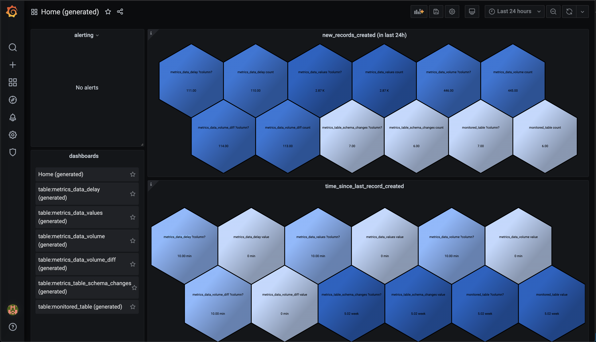
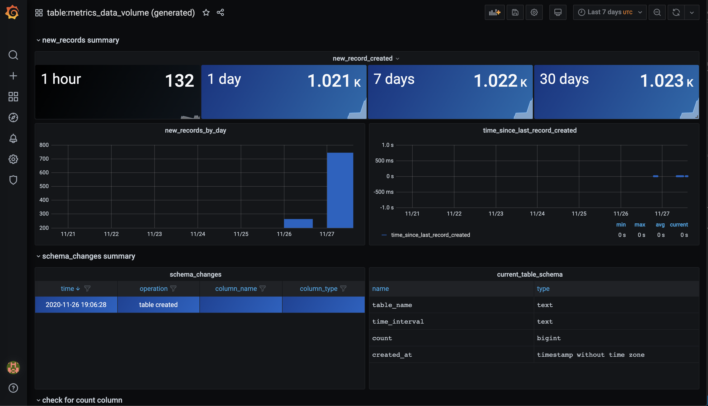

# Redata
Monitoring system for data teams.
Computing health checks on data (via Airflow jobs), visualizing them over time, and alerting on them in Grafana.


# Key features

## Metrics layer

Redata computes health metrics for your data, containing information like this:

* time since last record was added
* number of records added in last (hour/day/week/month)
* schema changes that recently happened
* number of nulls in columns over time
* other checks specific to columns in data and their types

*If you have DevOps experience, you can think of it as: prometheus, telegraf for data teams*

## Automatic dashboards

Having metrics in one common format, makes it possible to create dashboards automatically, for all (or chosen) tables
in your data. Currently there are 2 types of dashboard redata creates:
* home dashboard, containing most important information about all tables
* table dashboard, containing information specific to given table and columns in it

Here are some examples of how generated Grafana dashboards look like:

</img>
<br>
*Get a glimpse of what's happening in all your tables on one screen. If you see, any suspicious numbers click on the tile for more details on this specific table.* 

</img>
<br>
*Get an in-depth view of your table, learn about any schema changes, volume fluctuations, nulls in columns, and other useful metrics.*

## Batteries included

No need to setup Airflow, Grafana or DB for storing metrics. Redata will setup all of those via Docker images, you need to deploy only one thing.

*Easy production deployment on AWS, GCP is something we will be working on, currentlly you would need to figure it out yourself, what we have is docker-compose for setting up pieces to make it work*

# Benefits over doing monitoring yourself
Grafana supports PostgreSQL and lot of others DBs, so what are benefits of using redata over setting monitoring yourself with couple of SQL queries?
Here is a our list :)

 * **Visualizing all tables together in one dashbard** - Computing metrics layer make it really easy to do visulizations for many/all tables at once and showing them under one dashboard.
 
 * **Visualizing new, previously impossible things** - Things like schema changes, cannot be queried from DB, but computing metrics over time makes showing those possible.
 
 * **Visualizing how things change over time** - If you are doing any updates to DB, like updating row status etc. it's impossible to visualize how things looked liked in the past and compare it to now (for alerting purposes etc.), adding metrics layer makes it easy.
 
 * **Automatic and up to date dashboards** - It's normally quite cumbersome to setup proper monitoring for all tables and keeping it up to date is hard - redata can do that for you, detecting new tables and columns and automatically creating dashboards/panels for them.

# Getting started (local machine setup)

```

git clone https://github.com/redata-team/redata.git
cp env_template .env
# create REDATA_SOURCE_DB_URL_YOUR_DB_NAME variables (at the end of .env file, you can add multiple variables there)

docker-compose up

```

And metrics should be ready to look at in your grafana :)
Visit http://localhost:3000 to check them (use docker IP in case of using docker via virtulbox, grafana default password is admin/admin)

Visit http://localhost:8080 to check airflow jobs, turn on dag in airflow, so that checks run every 10 minutes.


# Community

Join [Slack](https://join.slack.com/t/redatahq/shared_invite/zt-jk8imy5f-OPjSHv7fCpfYUGyktw_qvw) for general questions about using redata, problems, and discussions with people making it :)


# Integrations

Here are integrations we support or work on now. Let us know if you'd really like to pritize something or your DB is not included on the list.

<table>
	<thead>
		<tr>
			<th colspan="2">Integration</th>
			<th>Status</th>
		</tr>
	</thead>
	<tbody>
		<tr><td>          </td><td style="width: 200px;">Postgres                 </td><td>Supported</td></tr>
		<tr><td></td><td style="width: 200px;">BigQuery</td><td>Planned</td></tr>
		<tr><td>                       </td><td style="width: 200px;">MySQL                    </td><td>Supported (experimental)</td></tr>
		<tr><td>                 </td><td style="width: 200px;">AWS Redshift             </td><td>In development</td></tr>
		<tr><td>   </td><td style="width: 200px;">AWS S3                   </td><td>In development</td></tr>
  <tr><td>   </td><td style="width: 200px;">Excel                   </td><td>Planned</td></tr>
		<tr><td> </td><td style="width: 200px;">Snowflake                </td><td>Planned</td></tr>
		<tr><td></td><td style="width: 200px;">Apache Airflow           </td><td>Supported, view all your checks in Airflow </td></tr>
		<tr><td>                                         </td><td style="width: 200px;">Other SQL DBs</td><td>Experimental support via using SQLAlchemy</td></tr>
		<tr><td>                                             </td><td style="width: 200px;">Grafana        </td><td>Supported, view metrics here</td></tr>
	</tbody>
</table>


# License
Redata is licensed under the MIT license. See the [LICENSE](LICENSE) file for licensing information.
