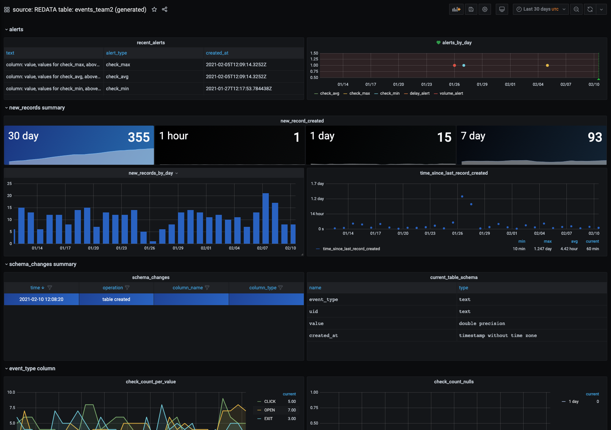

<p align="left">
<a href="https://join.slack.com/t/redatahq/shared_invite/zt-lrp4khvb-kIS6ct4WzJTy~JNVzwB5ywg"></a>
</p>


# Redata
Monitoring system for data teams.
Computing health checks on data, visualizing them over time, and alerting on them.

# Key features

## Metrics layer

Redata computes health metrics for your data, containing information like this:

* time since last record was added
* number of records added in last (hour/day/week/month)
* schema changes that recently happened
* number of missing values in columns over time
* min/max/avg of values and lenghts of strings in colums
* other user defined metrics

*If you have DevOps experience, you can think of Redata as: prometheus, telegraf for data teams*

## Automatic dashboards

Having metrics in one common format, makes it possible to create dashboards automatically, for all (or chosen) tables

Here are some examples of how generated Grafana dashboards look like:

</img>

Redata UI makes it easy to control what's dashboards and metrics are generated and tweak that to your needs

</img>

## Smart alerts

Redata compares metrics computed in the past to current metrics and alerts if anomalies are found. This means that situations like this:
 * sudden drops or increases in the volume of new records added to your tables
 * longer than expected break between data arrivals
 * significantly different maximal/minimal/avg numbers in any of table columns
 * and more

Would be detected, and you will be alerted. Redata supports Slack (with others tools possible to integerate for you via Grafana) so you can also set up alerts to your favorite support channel.

## Batteries included

No need to setup Airflow, Grafana or DB for storing metrics. Redata will setup all of those via Docker images, you need to deploy only one thing.
Check out deplying on production section for info how to easily deploy redata on AWS or GCP.

# Benefits over doing monitoring yourself
Grafana supports PostgreSQL and lot of others DBs, so what are benefits of using redata over setting monitoring yourself with couple of SQL queries?
Here is a our list :)

 * **Automatic and up to date health dashboards** - It's normally quite cumbersome to setup proper monitoring for all tables and keeping it up to date is hard - redata can do that for you, detecting new tables and columns and automatically creating dashboards/panels for them.
 
 * **Smart alerts** - Once tables are detected redata automatically tracks their health and looks for anomalies there. Alerts are designed specifically for data quality checks and separete from Grafana alerts (no limits on what to alert on, etc.)
 
 * **Visualizing new, previously impossible things** - Things like schema changes, cannot be queried from DB, but computing metrics over time makes showing those possible.
 
 * **Big set of predefined and effectively computed metrics** * - Redata comes with large set of predefined metrics, computed out of box for your tables. We also optimize quries in ways which are hard to do yourself when doing custom monitoring setup

# Getting started (local machine setup)

```
git clone https://github.com/redata-team/redata.git
cd redata

docker-compose up
```

Now visit http://localhost:5000, add your database and starting monitoring your data :)


# Deploying on production

Redata uses `docker` and `docker-compose` for deployment, this makes it easy to deploy in the cloud, or in your on premise enviroment. 

Look at sample setup instructions for specfic cloud providers:

 - [AWS EC2 deployment](deployment/aws_ec2_awslinux/deployment.md),
 - [AWS Fargate via Pulumi](deployment/pulumi_aws_fargate/README.md),
 - [GCP Compute Engine deployment](deployment/gcp_compute_engine_debian/deployment.md)

# Community

Join [Slack](https://join.slack.com/t/redatahq/shared_invite/zt-lrp4khvb-kIS6ct4WzJTy~JNVzwB5yw) for general questions about using redata, problems, and discussions with people making it :)


# Integrations

Here are integrations we support or work on now. Let us know if you'd really like to pritize something or your DB is not included on the list.

<table>
	<thead>
		<tr>
			<th colspan="2">Integration</th>
			<th>Status</th>
		</tr>
	</thead>
	<tbody>
		<tr><td></td><td style="width: 200px;"><a href="https://www.postgresql.org/">PostgreSQL</a></td><td>Supported</td></tr>
		<tr><td></td><td style="width: 200px;"><a href="https://www.mysql.com/">MySQL</a></td><td>Supported</td></tr>
		<tr><td></td><td style="width: 200px;"><a href="https://www.exasol.com/">Exasol</a></td><td>Supported</td></tr>
		<tr><td></td><td style="width: 200px;"><a href="https://cloud.google.com/bigquery">BigQuery</a></td><td>Supported</td></tr>
		<tr><td></td><td style="width: 200px;"><a href="https://airflow.apache.org/">Apache Airflow</a></td><td>Supported, view all your checks in Airflow </td></tr>
		<tr><td></td><td style="width: 200px;"><a href="https://grafana.com/">Grafana</a></td><td>Supported, view metrics here</td></tr>
		<tr><td></td><td style="width: 200px;"><a href="https://slack.com/">Slack</a></td><td>Supported, get alerts on Slack</td></tr>
		<tr><td></td><td style="width: 200px;">Other SQL DBs</td><td>Experimental support via using SQLAlchemy</td></tr>
		<tr><td></td><td style="width: 200px;">AWS Redshift</td><td>In development</td></tr>
		<tr><td>   </td><td style="width: 200px;">AWS S3</td><td>In development</td></tr>
  		<tr><td>   </td><td style="width: 200px;">Excel</td><td>Planned</td></tr>
		<tr><td> </td><td style="width: 200px;">Snowflake</td><td>Planned</td></tr>
	</tbody>
</table>


# License
Redata is licensed under the MIT license. See the [LICENSE](LICENSE) file for licensing information.


# Contributing

We love all contributions, bigger and smaller.

Checkout our list of [good first issues](https://github.com/redata-team/redata/issues?q=is%3Aissue+is%3Aopen+label%3A%22good+first+issue%22) and see if you like anything from there. Also feel welcome to join our [Slack](https://join.slack.com/t/redatahq/shared_invite/zt-lrp4khvb-kIS6ct4WzJTy~JNVzwB5yw) and suggest ideas, or setup no pressure session with Redata [here](https://calendly.com/mateuszklimek/30min). 

More details on how to tests your changes under: [CONTRIBUTING](https://github.com/redata-team/redata/blob/master/CONTRIBUTING.md)

If you got this far and like what we are building, support us! Star https://github.com/redata-team/redata on Github :)
