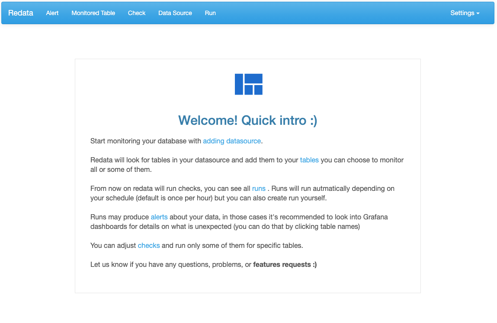
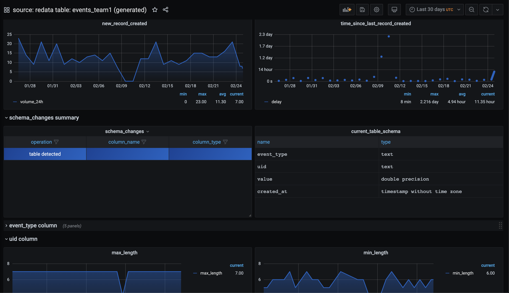

<p align="center">
<a href="http://redata.team/slack"></a>
<a href="https://hub.docker.com/r/redatateam/redata"> </a>


</p>

# Redata


<p align="center">
</img>
</p>

*Do you know this feeling? -
Something in your data broke, you patiently added monitoring to detect that in the future... only so, that the next time different not expected thing went wrong :)*

Redata is monitoring system for data teams. Automatically computing health checks on all your tables, visualizing them over time, and alerting on them.

# Key features

## Metrics layer

Redata computes health metrics for your data, containing information like this:

* time since last record was added
* number of records added in last (hour/day/week/month)
* schema changes that recently happened
* number of missing values in columns over time
* min/max/avg of values and lenghts of strings in colums
* other user defined metrics

## Detecting anomalies

Redata compares metrics computed in the past to current metrics and alerts if anomalies are found. This means that situations like this:
 * sudden drops or increases in the volume of new records added to your tables
 * longer than expected break between data arrivals
 * increase in NULL values in one of your columns
 * different maximal/minimal/avg numbers in any of table columns
 * and much more

Would be detected, and you will be alerted. Redata supports sending alerts to Slack, so you can get notification there and react quickly.

## UI with alerts, tables & checks
Redata UI enables you to view all your tables and anomalies found.
You can also adjust what metrics and tables are monitored here.

</img>

## Automatic dashboards

When something seems off in your tables, it's often usefull to look into how your data looks like.
Redata automatically creates dashboards with metrics it computed over time for all your tables.

</img>

# Getting started (local machine setup)

```
git clone https://github.com/redata-team/redata.git
cd redata

docker-compose up
```

Now visit http://localhost:5000, add your database and start monitoring your data. Default password/user for Redata/Grafana app is `redata` :)


# Deploying on production

Redata uses `docker` and `docker-compose` for deployment, this makes it easy to deploy in the cloud, or in your on premise enviroment. 

Look at sample setup instructions for specfic cloud providers:

 - [AWS EC2 deployment](deployment/aws_ec2_awslinux/deployment.md),
 - [AWS Fargate via Pulumi](deployment/pulumi_aws_fargate/README.md),
 - [GCP Compute Engine deployment](deployment/gcp_compute_engine_debian/deployment.md)

# Community

Join [Slack](http://redata.team/slack) for general questions about using redata, problems, and discussions with people making it :)


# Integrations

Here are integrations we support. If your stack is not yet here, feel free to submit issue for it :)

<table>
	<thead>
		<tr>
			<th colspan="2">Integration</th>
			<th>Status</th>
		</tr>
	</thead>
	<tbody>
		<tr><td></td><td style="width: 200px;"><a href="https://www.postgresql.org/">PostgreSQL</a></td><td>Supported</td></tr>
		<tr><td></td><td style="width: 200px;"><a href="https://www.mysql.com/">MySQL</a></td><td>Supported</td></tr>
		<tr><td></td><td style="width: 200px;"><a href="https://www.exasol.com/">Exasol</a></td><td>Supported</td></tr>
		<tr><td></td><td style="width: 200px;"><a href="https://cloud.google.com/bigquery">BigQuery</a></td><td>Supported</td></tr>
		<tr><td></td><td style="width: 200px;"><a href="https://airflow.apache.org/">Apache Airflow</a></td><td>Supported, view all your checks in Airflow </td></tr>
		<tr><td></td><td style="width: 200px;"><a href="https://grafana.com/">Grafana</a></td><td>Supported, view metrics here</td></tr>
		<tr><td></td><td style="width: 200px;"><a href="https://slack.com/">Slack</a></td><td>Supported, get alerts on Slack</td></tr>
		<tr><td></td><td style="width: 200px;">Other SQL DBs</td><td>Experimental support via using SQLAlchemy</td></tr>
		<tr><td></td><td style="width: 200px;"><a href="https://aws.amazon.com/redshift/">AWS Redshift</a></td><td>Supported</td></tr>
		<tr><td> </td><td style="width: 200px;"><a href="https://www.snowflake.com/">Snowflake</a></td><td>Supported</td></tr>
		<tr><td> </td><td style="width: 200px;"><a href="https://www.microsoft.com/en-us/sql-server/sql-server-downloads">SQL Server</a></td><td>Supported</td></tr>
	</tbody>
</table>


# License
Redata is licensed under the MIT license. See the [LICENSE](LICENSE) file for licensing information.

# Docs

Want to learn a bit more on how Redata works.
We recommend starting with data source which explains how to configure you DB.
Later on table, scan, alert are views you most likely will be checking first when using Redata.
Checks are coputing all metrics in Redata, you can edit them to stop computing some of them, but also add your own SQL based checks.

 - [Data Source](docs/datasource.md)
 - [Table](docs/table.md)
 - [Scan](docs/scan.md)
 - [Alert](docs/alert.md)
 - [Check](docs/check.md)
 - [Adding custom SQL check](docs/create_custom_sql_check.md)


# Contributing

We love all contributions, bigger and smaller.

Checkout out current list of issues [here](https://github.com/redata-team/redata/issues) and see if you like anything from there. Also feel welcome to join our [Slack](http://redata.team/slack) and suggest ideas, or setup no pressure session with Redata [here](https://calendly.com/mateuszklimek/30min). 

General info about contriuting is [here](https://github.com/redata-team/redata/blob/master/CONTRIBUTING.md)

If you would like to add support for your DB more info on that is [here](https://github.com/redata-team/redata/blob/master/CONTRIBUTING_DB.md)

And if you got this far and like what we are building, support us! Star https://github.com/redata-team/redata on Github :)

