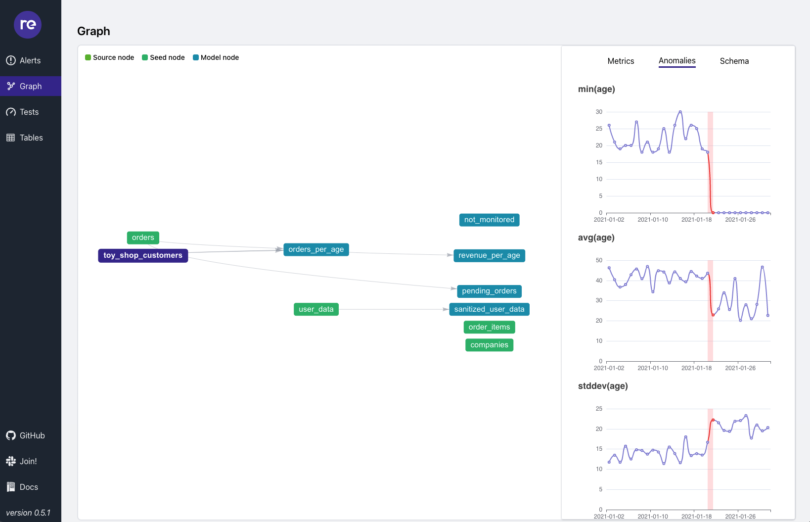

# What is re_data?

re_data is an open-source data reliability framework for the modern data stack. 😊

Currently, re_data focuses on observing the dbt project (together with underlaying data warehouse - Postgres, BigQuery, Snowflake, Redshift).

# Live demo

Check out our **[live demo](https://getre.io/demo)** of what re_data can do for you 😊

# Getting started

**[Check our docs!](https://docs.getre.io/)** 📓 📓 📓

**[Join re_data community on Slack](https://www.getre.io/slack)** (we are very responsive there)

# Support

If you like what we are building, support us! Star ⭐ [re_data](https://github.com/re-data/re-data) on Github. We will also plant a tree 🌳 for every star we get, so you will also support our planet 🌍 😊

# License
re_data is licensed under the MIT license. See the [LICENSE](LICENSE) file for licensing information.

# Contributing

We love all contributions :heart_eyes: bigger and smaller.

Check out the current list of issues [here](https://github.com/re-data/re-data/issues) and see if you like anything from there. Also, feel welcome to join our [Slack](https://www.getre.io/slack) and suggest ideas or set up a live session [here](https://calendly.com/mateuszklimek/30min). 

